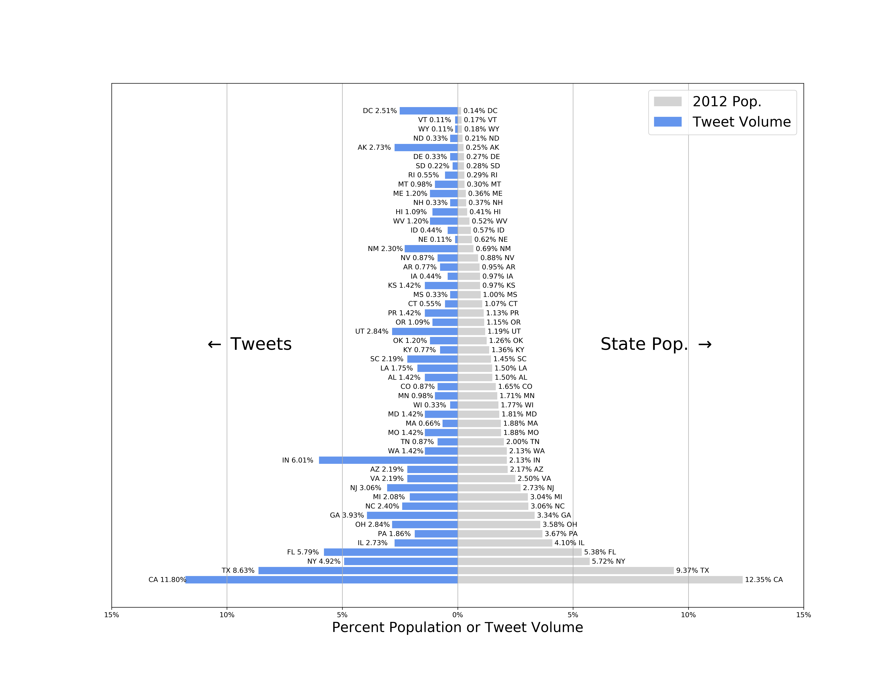

## Fuzzy Geocoding on Tweets

When analyzing social media data we often want to add a geographic element to the activity. 
This isn't always so easy due to data availability and user practices with location disclosure. 
Here I run over some preliminary results from my first experience with attempting fuzzy-string geocoding 
on Twitter-users' self-disclosed location strings. 

There are a couple ways to go about gettiing geographic data for Twitter.
When looking at Tweets,
the easiest case is obviously when the user enables geolocation and precise(ish) coordinates are available for the activity.
This has its limitations, especially in more recent years (~2015+) where changes to Twitter defaults have left very
few accounts with geolocation enabled (there are also concerns about the types of accounts likely to enable this feature).
At one point I found less than 1% of tweets in our random 10% sample had precise geolocation information available. 

There have been other approaches proposed such as looking at the content of tweets to infer location. 
Others have used propogated location information across the social network in order to fill in missing
geographic data [[1]](https://ojs.aaai.org/index.php/ICWSM/article/view/14399).

The other approach that I've seen some colleagues explore involves fuzzy string matching in order to geocode
the location string in user bios. 
For this work I was focused on the US and used the python library [uszipcode](https://uszipcode.readthedocs.io/)[2]
The library provides a convenient search engine for matching strings for cities and states with agaisnt known regions. 
Using regular expressions I extracted user bios that roughly fit templates such as `city, state`, `city, state, country`, etc.

I cross-referenced the results of the geocoding with data from the 2012 US Census to get a sense where our method
was under or overcounting, at least relative to known state populations. 
Of course, comparing Twitter users (even if the geocoding was perfectly accurate) to state population is 
a bit of funny comparison to make, but it was largely meant as a reference point. 

#### References 
[1] https://ojs.aaai.org/index.php/ICWSM/article/view/14399

[2] https://uszipcode.readthedocs.io/
