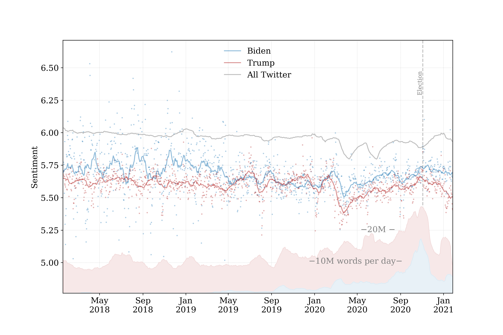

## POTUS anchored sentiment

As the 2020 US Presidential election came and went, I was curious how the conversation around Trump and Biden
responded to contemporaneous events. Using the LabMT[1] dataset (which underpins the [Hedonometer](hedonometer.org))
I scored daily word frequency-distributions for Tweets containing the 1-gram `biden` and `trump`.
From this, we can see how both sentiment time series responded to COVID19, the George Floyd's death, 
and the January 6th insurrection at the US Capitol. 

Fig. 1: Anchored sentiment for tweets mentioning Biden and Trump. 

The selection criteria introduces some considerations. For instance it will include tweets that are retweets from either 
the Biden or Trump accounts. This is notable especially in Trump's considering his tweets' tendency to attract significant attention
in the form of response activities---in effect leading RTs of his content to have a disproportionate effect on the ambient sentiment measurement.  

[1] Dodds, Peter Sheridan, et al. "Temporal patterns of happiness and information in a global social network: Hedonometrics and Twitter." PloS one 6.12 (2011): e26752.